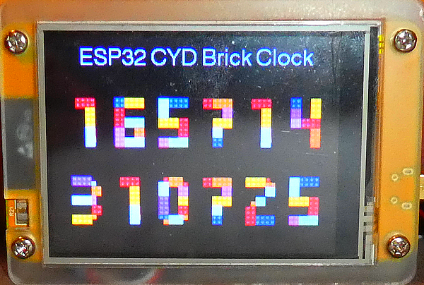

# ESP32 Cheap Yellow Display (CYD) Brick Clock

This is the accompanying repository for my article "Create a colorful digital clock on an ESP32 Cheap Yellow Display ("CYD")" available here: https://medium.com/@androidcrypto/create-a-colorful-digital-clock-on-an-esp32-cheap-yellow-display-cyd-641db4642e47

For short - what is a "Cheap Yellow Display" ? This device was introduced some years ago and allowed for very fast development of projects where an ESP32, a TFT (optional Touch surface), an SD Card Reader and an RGB LED is required. The first version was equipped with a 2.8 inch large TFT display with **ILI9341** driver chip and **XPT2046** resistive Touch driver chip. Newer versions are sold with a **ST7789** display driver chip. Nowadays, the device is available with different display sizes (1.28 up to 7 inches) and driver chips, but I'm focusing on the 2.8 inch variants. The display has a size of **320 x 240** pixels in Landscape orientation. Most of the devices are driven by an ESP32 WROOM microcontroller, but I saw some others with an ESP32-S3 chip.



## Set up the TFT_eSPI library

Please don't forget to copy the files "Setup801_ESP32_CYD_ILI9341_240x320.h" and "Setup805_ESP32_CYD_ST7789_240x320.h" in the "User_Setups" folder of the TFT_eSPI library and edit the 
"User_Setup_Select.h" to include the set up, depending on your CYD board type (ILI9341 or ST778).

## Required Libraries
````plaintext
TFT_eSPI Version: 2.4.3 *1) (https://github.com/Bodmer/TFT_eSPI)

*1) In case you encounter any problems with the TFT_eSPI library you should consider to use my forked TFT_eSPI library that solved some problems, see link below
````

Forked TFT_eSPI library by AndroidCrypto: https://github.com/AndroidCrypto/TFT_eSPI

## Development Environment
````plaintext
Arduino IDE Version 2.3.6 (Windows)
arduino-esp32 boards Version 3.2.0 (https://github.com/espressif/arduino-esp32)
````
